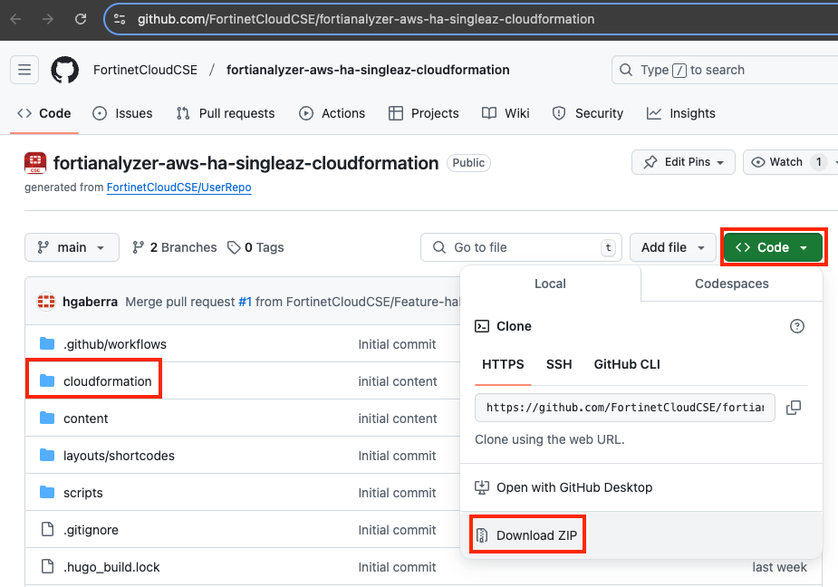
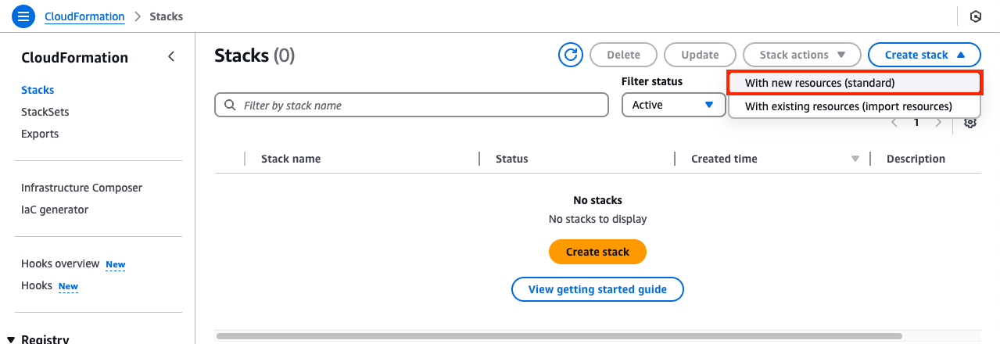
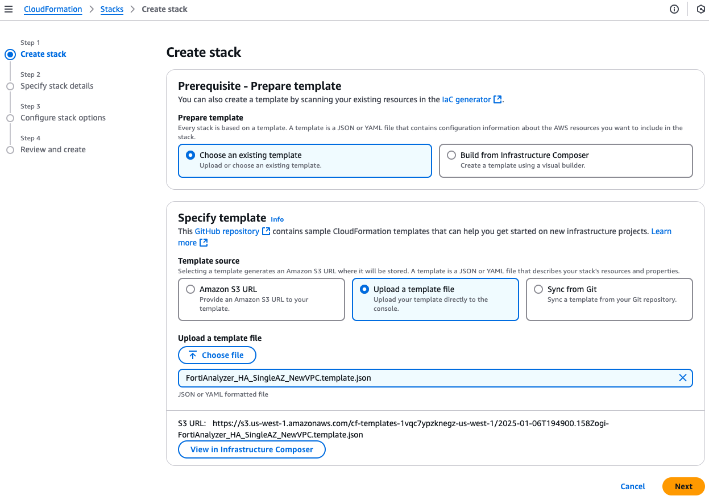
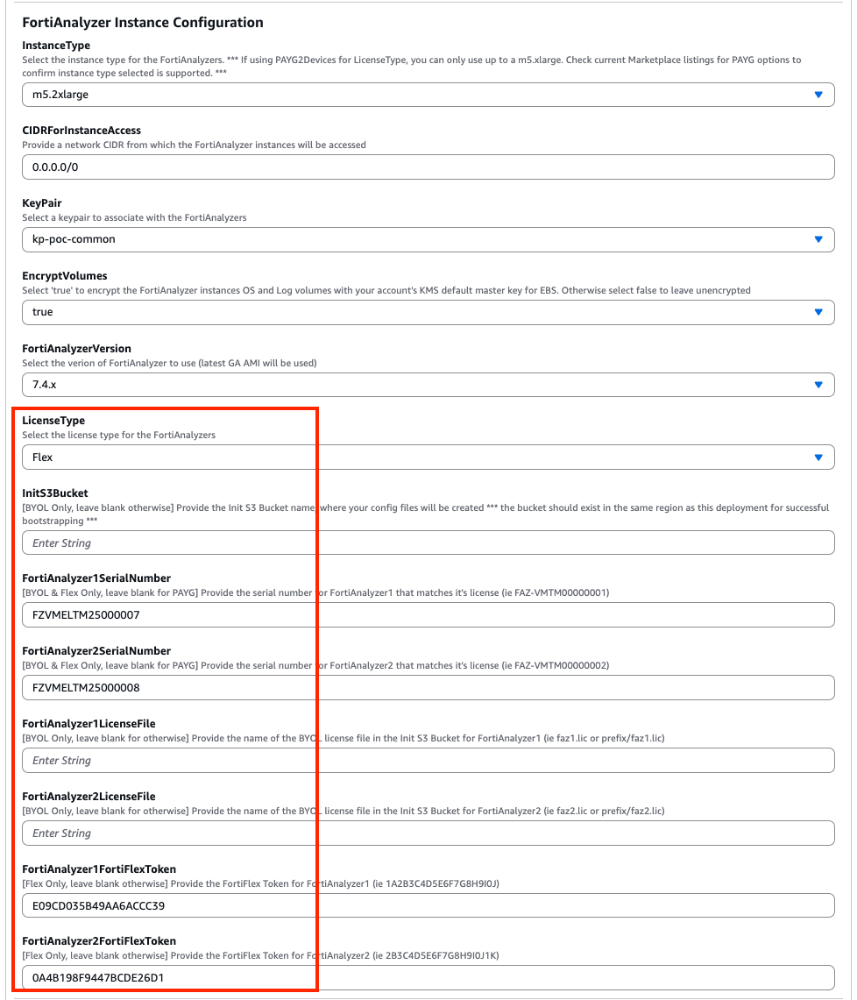
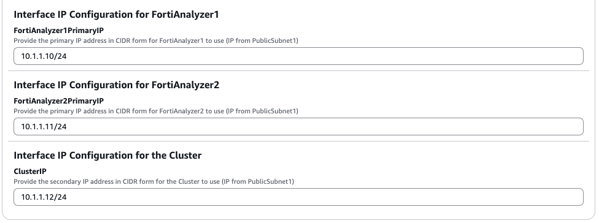
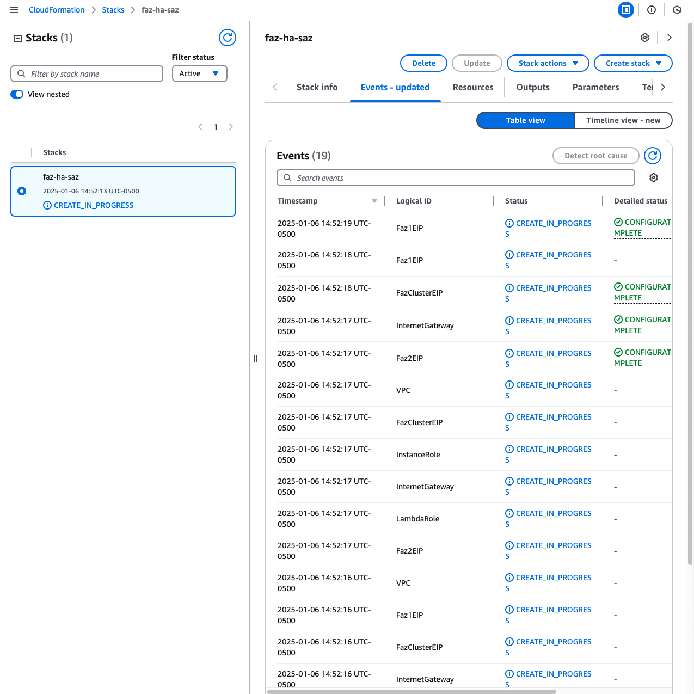

Once the prerequisites have been satisfied proceed with the deployment steps below.

1.  To download the template, you can either clone the repo with the git command below, or [**download**](https://github.com/FortinetCloudCSE/fortianalyzer-aws-ha-singleaz-cloudformation) the repo as a ZIP archive.  The template is in the **/cloudformation folder**

```
git clone https://github.com/FortinetCloudCSE/fortianalyzer-aws-ha-singleaz-cloudformation.git
```



2.  Login to your AWS account.  In the AWS services page under All Services > Management Tools, select CloudFormation.

	

3.  Select Create Stack then select with new resources.

	

4.  On the Select Template page, under the Choose a Template section select Upload a template to Amazon S3 and browse to your local copy of the chosen deployment template.

	

5.  On the Specify Details page, you will be prompted for a stack name and parameters for the deployment.  We are using the **'FortiAnalyzer_HA_singleaz_NewVPC.template.json'** template which deploys a FMG into a new VPC's public subnets and gives options for configuring the instance settings.






6.  In the FortiAnalyzer Instance Configuration parameters section, we have selected an Instance Type and Key Pair to use, chose to encrypt both OS and Log disks, as well as Flex licensing.  Notice we are prompted for the licensing type which we are going with BYOL.  In our case we do not need to fill out the InitS3Bucket parameter.

7.  In the Interface IP Configuration for the FortiAnalyzer parameters section, we are going with the defaults in this example as the subnet addressing matches.  This IP will be the primary IP assigned to the FortiAnalyzer ENI.

8.  On the Options page, scroll down to the capabilities section.  As the template will create IAM resources, you need to acknowledge this by checking the box next to ‘I acknowledge that AWS CloudFormation might create IAM resources’ and then click Next.

	

9.  On the Review page, you can scroll to the bottom and select Submit.

10.  On the main AWS CloudFormation console, you will now see your stack being created.  You can monitor the progress by selecting your stack and then select the Events tab.



11.  Once the stack creation has completed successfully, select the Outputs tab to get the login information for the FortiAnalyzer instances.


12.  This concludes the template deployment example.
